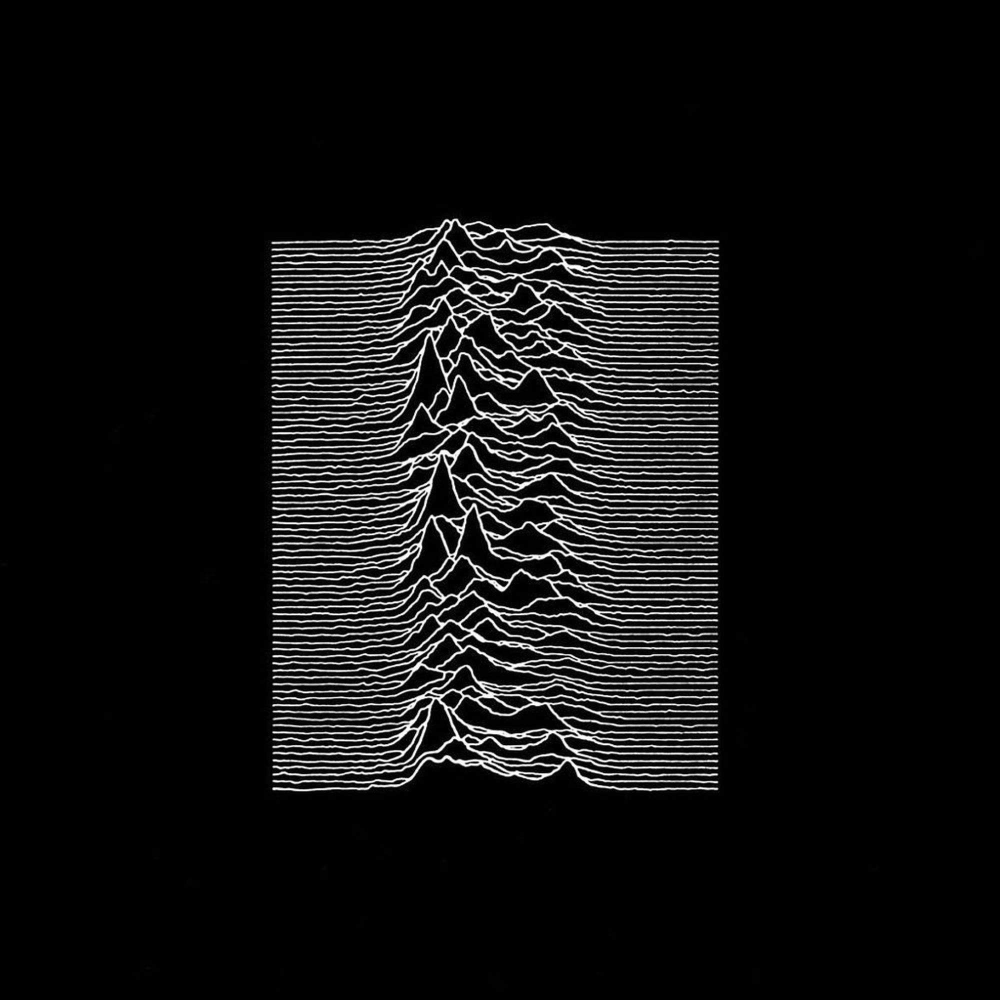
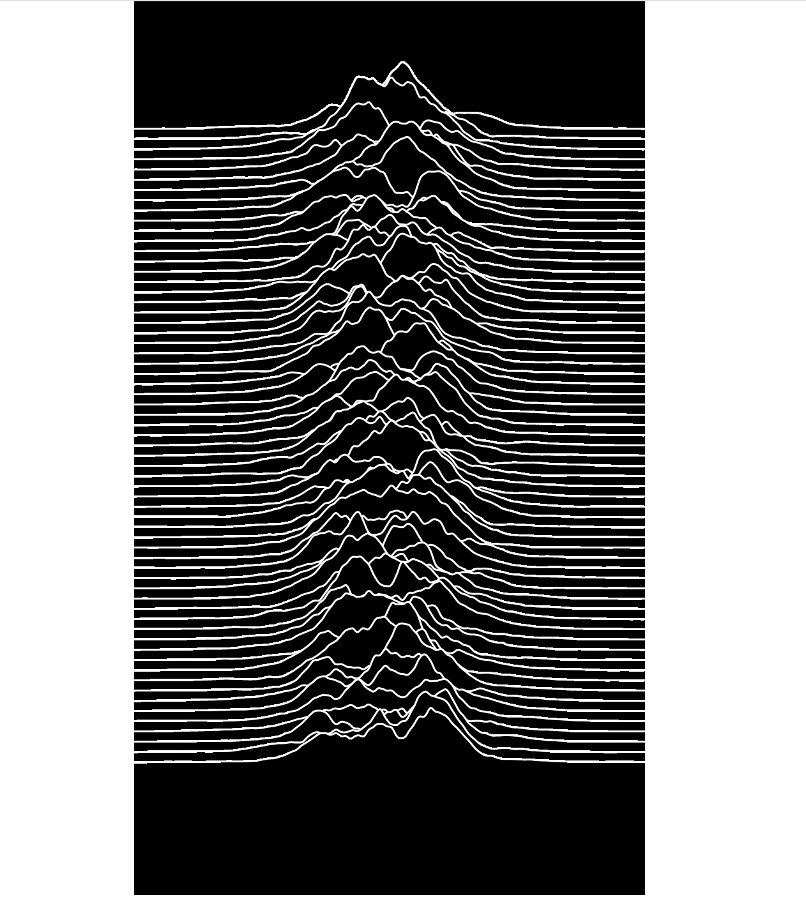
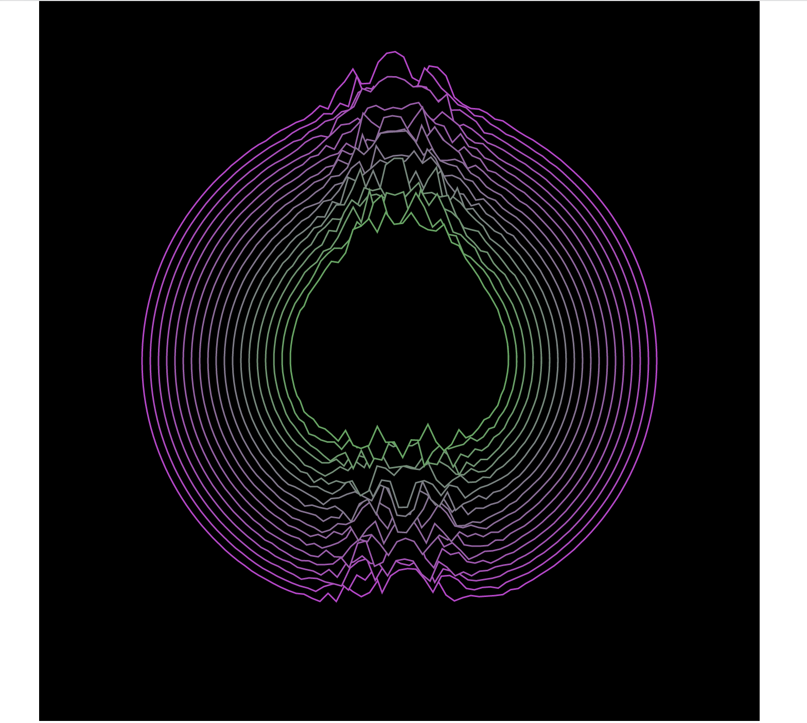

# Algorithmic Aesthetics : Coding & Recoding work

Work on the cover of Joy Division, "Unknown Pleasure". For the first year IMAC aesthetic algorithm course.

The original artwork

The coding result

The recoding result
